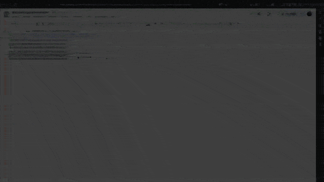

# Token Tools



Token Tools is a dApp designed for users who want to airdrop tokens or send tokens to multiple users in a few transactions, with customizable transaction fees. Built with Next.js.

https://bulksendtokens.xyz/

## 1) Presentation

Token Tools allows users to efficiently create, lock and distribute tokens via bulk transactions, minimizing fees.

## 2) What You Can Do With Bulk Sender

- **Airdrop Native Tokens:** Distribute ETH efficiently.
- **Airdrop ERC20 Tokens:** Bulk transfer of ERC20 tokens.
- **Airdrop ERC721 Tokens:** Send multiple ERC721 tokens.
- **Airdrop ERC1155 Tokens:** Efficiently distribute ERC1155 tokens.
- **VIP Membership:** Free usage for VIP members.

## 3) Disclaimer

### Disclaimer

The `BulkSender` contract facilitates bulk transfers of ETH, ERC20, ERC721, and ERC1155 tokens. Before use:

- Test thoroughly in a safe environment.
- Verify compatibility with target token contracts.
- Understand gas costs and risks for large transactions.

**Note:** Use at your own risk. Neither Foundry nor the authors are responsible for any losses.

## 4) Deploy contracts

### Prerequisites

- NodeJs

### Deployment Steps

1. **Create a `.env` file** in the root project directory:

```env
INFURA_KEY=
ETHERSCAN_KEY=
PRIVATE_KEY=
OWNER_ADDRESS=
```

2. **Initialize submodules:**

```bash
npm i
```

3. **Build and Deploy Contracts:**

# Network Deployment Commands
## Ethereum
- ```npm run deploy-token-creator -- --network mainnet```
- ```npm run deploy-bulksender -- --network mainnet```
## Base
- ```npm run deploy-token-creator -- --network base```
- ```npm run deploy-bulksender -- --network base```
## BNB
- ```npm run deploy-token-creator -- --network bnb```
- ```npm run deploy-bulksender -- --network bnb```

4. ** Verify contracts:**

```bash
npm run verify:sepolia CONTRACT_ADDRESS OWNER_ADDRESS
```
